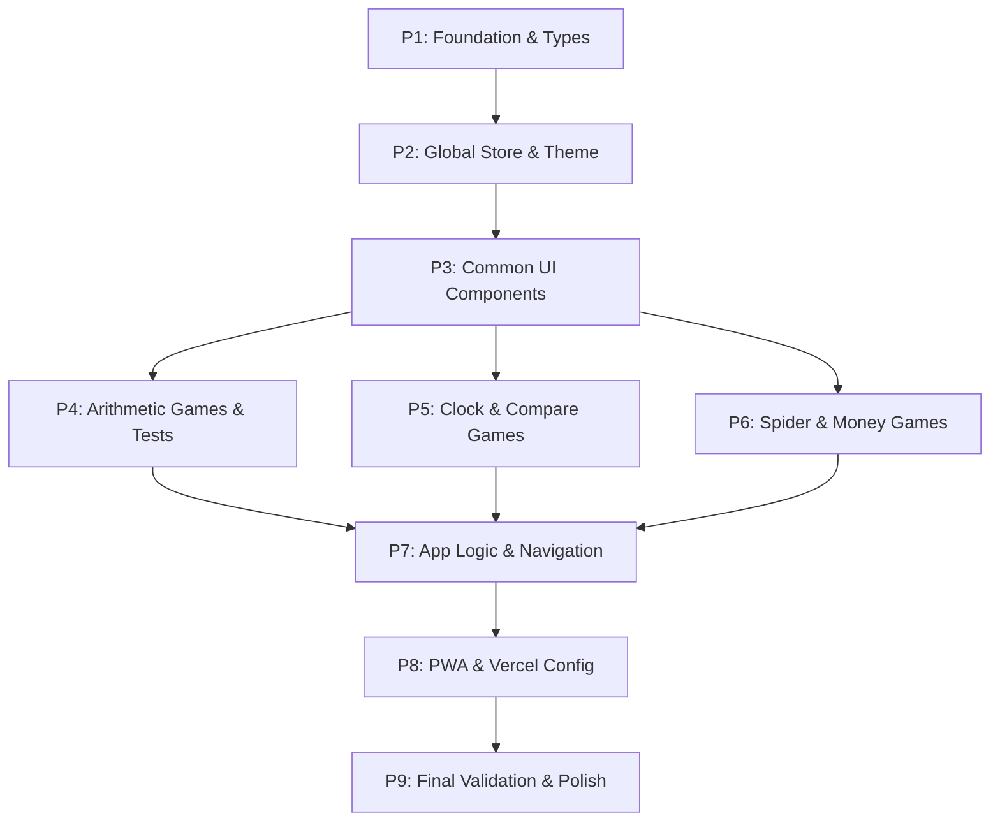

# 1. 플랜 개요 (Plan Overview)
이 계획은 기존의 단일 파일 SPA를 SvelteKit, TypeScript, Tailwind CSS 기반의 현대적 아키텍처로 전환하는 과정을 다룹니다. 총 9개 단계로 구성되며, 기초 인프라 구축 후 개별 게임 컴포넌트를 독립적으로 이식합니다.

# 2. 종속성 그래프 (Dependency Graph)

# 3. 실행 전략 (Execution Strategy)
| 단계 | 에이전트 | 실행 모드 | 주요 결과물 |
| :--- | :--- | :--- | :--- |
| **P1** | architect | Sequential | SvelteKit 초기화, TS 인터페이스 정의 |
| **P2** | architect/coder | Sequential | gameStore.ts, Tailwind 테마 설정 |
| **P3** | design_system_engineer | Sequential | Header, ProgressBar, Confetti 컴포넌트 |
| **P4** | coder/tester | Parallel (Batch 1) | ArithmeticGame.svelte, Vitest 테스트 |
| **P5** | coder | Parallel (Batch 1) | ClockGame.svelte, CompareGame.svelte |
| **P6** | coder | Parallel (Batch 1) | SpiderGame.svelte, MoneyGame.svelte |
| **P7** | architect/coder | Sequential | +page.svelte, Menu.svelte, 라우팅 로직 |
| **P8** | devops_engineer | Sequential | vite-plugin-pwa, vercel.json 최적화 |
| **P9** | code_reviewer/tester | Sequential | 전체 리그레션 테스트, 모바일 성능 점검 |

# 4. 단계별 상세 명세 (Phase Details)

## Phase 1: Foundation & Types
- **목표**: SvelteKit 프로젝트 초기화 및 공통 타입 정의.
- **에이전트**: `architect`
- **생성 파일**:
    - `src/lib/types.ts`: `IGameState`, `GameMode`, `Question` 등 인터페이스 정의.
- **수정 파일**: `package.json` (의존성 추가), `svelte.config.js` (adapter-static 설정).
- **검증**: `npm run dev` 실행 확인, 타입 체크 통과.

## Phase 2: Global Store & Theme
- **목표**: 전역 상태 관리 시스템 및 스타일 테마 구축.
- **에이전트**: `architect`, `coder`
- **생성 파일**:
    - `src/lib/stores/gameStore.ts`: 점수, 진행도, 현재 게임 모드 관리 (LocalStorage 연동).
    - `src/app.css`: Tailwind CSS 기본 설정 및 기존 CSS 변수 이식.
- **검증**: 스토어 상태 변경 시 LocalStorage에 정상 저장되는지 확인.

## Phase 3: Common UI Components
- **목표**: 모든 게임에서 공유되는 UI 요소 구현.
- **에이전트**: `design_system_engineer`
- **생성 파일**:
    - `src/lib/components/Header.svelte`: 제목, 점수, 뒤로가기 버튼.
    - `src/lib/components/ProgressBar.svelte`: 진행도 바.
    - `src/lib/components/Confetti.svelte`: canvas-confetti 래퍼 컴포넌트.
- **검증**: 컴포넌트들이 Tailwind 스타일이 적용된 상태로 정상 렌더링되는지 확인.

## Phase 4: Arithmetic Games & Tests
- **목표**: 덧셈, 뺄셈, 곱셈, 나눗셈 게임 이식 및 단위 테스트.
- **에이전트**: `coder`, `tester`
- **생성 파일**:
    - `src/lib/components/games/ArithmeticGame.svelte`: 4종 산술 연산 공통 컴포넌트.
    - `src/lib/components/games/ArithmeticGame.test.ts`: 연산 로직 및 문제 생성 테스트.
- **검증**: `npm run test` 통과, 게임 내 정답 처리 로직 확인.

## Phase 5: Clock & Compare Games
- **목표**: 시계 보기 및 크기 비교(저울) 게임 이식.
- **에이전트**: `coder`
- **생성 파일**:
    - `src/lib/components/games/ClockGame.svelte`: 시계 바늘 CSS Transform 로직 포함.
    - `src/lib/components/games/CompareGame.svelte`: 저울 기울기 애니메이션 포함.
- **검증**: 시계 바늘 각도 계산 및 저울 인터랙션 정상 작동 확인.

## Phase 6: Spider & Money Games
- **목표**: 거미 사다리(드래그 앤 드롭) 및 돈 세기 게임 이식.
- **에이전트**: `coder`
- **생성 파일**:
    - `src/lib/components/games/SpiderGame.svelte`: SVG 라인 렌더링 및 드래그 로직.
    - `src/lib/components/games/MoneyGame.svelte`: 동전 이미지 동적 렌더링.
- **검증**: 드래그 앤 드롭 인터랙션 및 돈 합계 계산 로직 확인.

## Phase 7: App Logic & Navigation
- **목표**: 메인 메뉴 및 게임 스위칭 시스템 구축.
- **에이전트**: `architect`, `coder`
- **생성 파일**:
    - `src/routes/+page.svelte`: 메인 엔트리 페이지.
    - `src/lib/components/Menu.svelte`: 게임 선택 카드 목록 (4열 그리드).
- **검증**: 메뉴에서 게임 선택 시 해당 게임으로 부드럽게 전환되는지 확인.

## Phase 8: PWA & Vercel Config
- **목표**: 오프라인 지원 및 배포 설정 최적화.
- **에이전트**: `devops_engineer`
- **수정 파일**:
    - `vite.config.ts`: `vite-plugin-pwa` 설정 추가.
    - `vercel.json`: 기존 설정 유지 및 정적 자산 경로 최적화.
- **검증**: 빌드 후 PWA 매니페스트 생성 및 Vercel 배포 확인.

## Phase 9: Final Validation & Polish
- **목표**: 전체 품질 점검 및 사용자 경험 최적화.
- **에이전트**: `code_reviewer`, `tester`
- **검증**: 모든 성공 기준(Success Criteria) 충족 여부 전수 조사, 모바일 실기기 테스트.

# 5. 위험 분류 (Risk Classification)
- **P6 (Spider Game)**: HIGH - 드래그 앤 드롭 로직이 복잡하여 Svelte의 반응형 시스템과 충돌할 가능성이 있음.
- **P8 (PWA Config)**: MEDIUM - 빌드 환경에 따라 서비스 워커 등록이 실패할 수 있음.
- **기타 단계**: LOW - 표준적인 Svelte 컴포넌트 이식 작업.

# 6. 비용 및 토큰 예산 추정 (Cost Estimation)
| 단계 | 에이전트 | 모델 | 추정 입력 | 추정 출력 | 추정 비용 |
| :--- | :--- | :--- | :--- | :--- | :--- |
| P1-P2 | architect | Pro | 15K | 2K | $0.23 |
| P3-P6 | coder/designer | Flash | 40K | 15K | $0.10 |
| P7-P9 | architect/devops | Pro | 20K | 3K | $0.32 |
| **합계** | | | **75K** | **20K** | **$0.65** |

# 7. 실행 프로필 (Execution Profile)
- 총 단계: 9
- 병렬 가능 단계: 3 (P4, P5, P6) - Batch 1
- 순차 전용 단계: 6
- 예상 병렬 실행 시간: 단축된 레이어 구조로 인해 순차 실행 대비 약 30% 시간 절감 가능.
